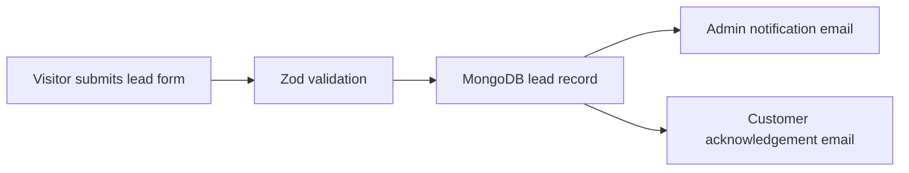
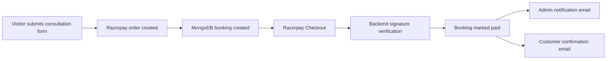
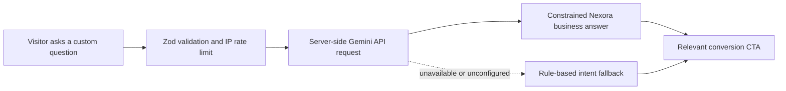

# Automation Workflow

## Lead Notification

## Paid Consultation

## Hybrid AI Chatbot

These workflows are implemented as custom Next.js backend automation using MongoDB, Razorpay, Nodemailer, and the Gemini Developer API.
